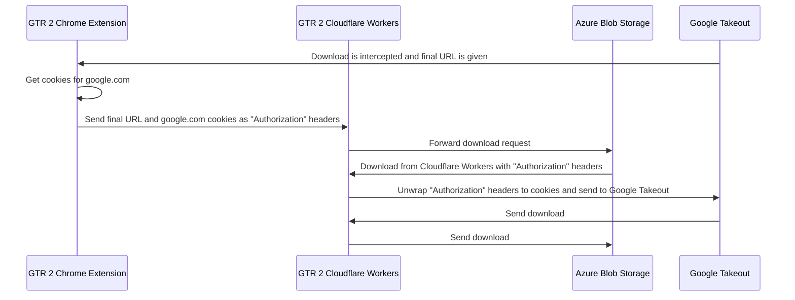

# Gargantuan Takeout Rocket 2 Dev Server

Gargantuan Takeout Rocket is a project to make transloading Google Takeout data to a cloud storage provider easier.

This is a development and test server for the Gargantuan Takeout Rocket 2 project. It is a simply Golang server used to test and develop the new transloading methodology.

Google recently changed their Takeout URLs from final URLs being 15-minute expiring URLs on Google Cloud Storage to "https://takeout-download.usercontent.google.com/download/" URLs that seem to take cookies and other session information to authenticate the download. This completely breaks GTR 1 which relied on only encoding and decoding the URLs with Cloudflare Workers to work with Azure Blob Storage limitations.

GTR 2 will adjust to this new approach. URLs no longer need to be encoded and decoded. However, we'll need to have the Chrome extension to get the cookies and session information, encode it as "Authorization" headers, send it to Cloudflare Workers which will send it Azure Blob Storage which will then pass it back to Cloudflare Workers to "unwrap" the cookies and session information from the "Authorization" headers and send it to Google's Takeout download URL to authenticate for the download.

Here's a sequence diagram of the new approach:

## Usage

The dev server will offer a few endpoints to develop and test functionality. It is not actually part of GTR 2 itself.